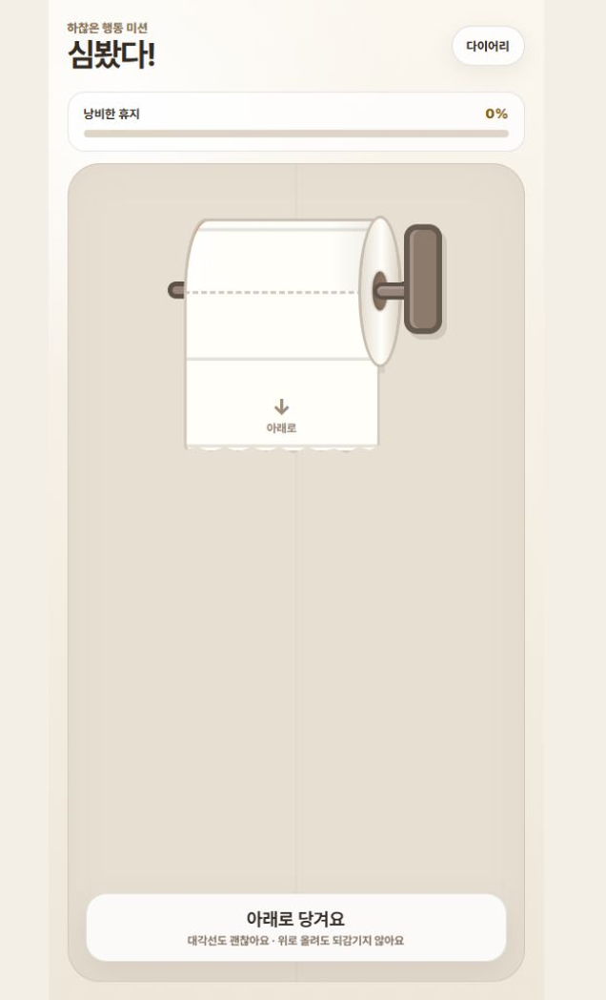
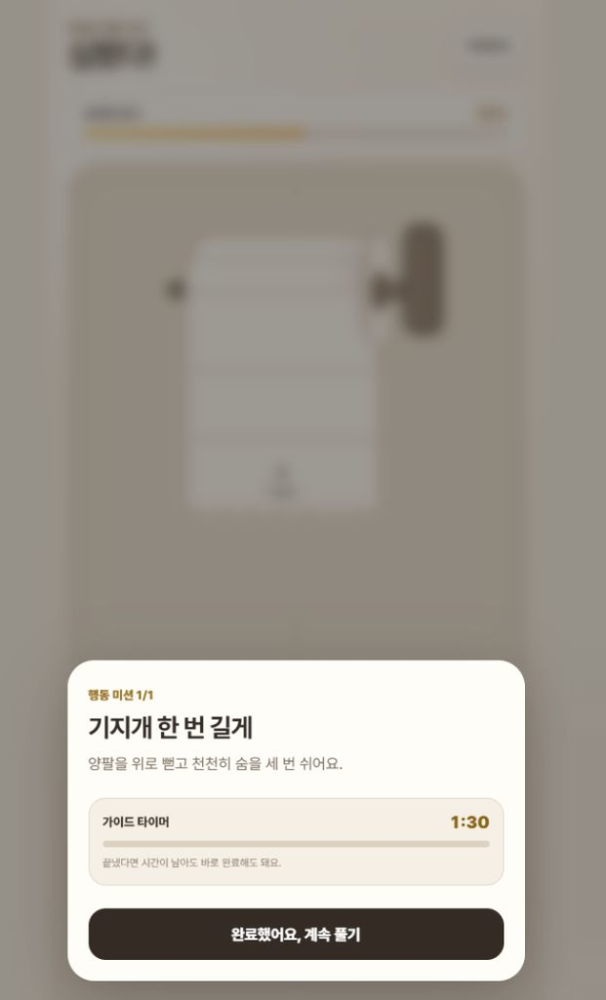
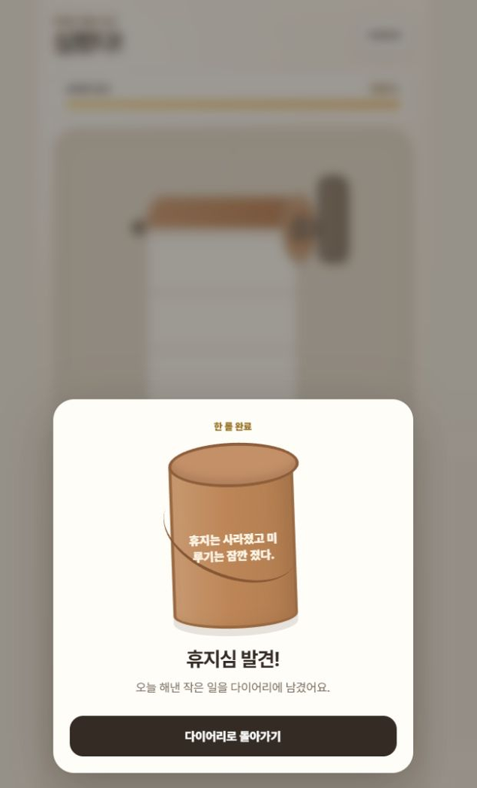

# 심봤다

<p align="center">
  
</p>

두루마리 휴지를 신나게 풀고, 중간에 나타나는 작은 행동 미션을 끝낸 뒤 황당한 휴지심을 모으는 짧은 미니게임입니다.

2026 Apps in Toss 바이브코딩 챌린지 출품작으로 시작했습니다. 한 손 조작, 빠른 속도감, 예상 밖의 돌발 칸과 짧은 성취감을 핵심 경험으로 삼습니다.

<p align="center">
  
  
  
</p>

## 게임 방법

1. 화면을 아래로 스와이프해 두루마리 휴지를 풉니다.
2. 중간에 나타나는 행동 미션을 완료합니다.
3. 휴지를 끝까지 풀어 랜덤 휴지심을 획득합니다.
4. 발견한 일반·황금 휴지심을 이 기기의 보관함에서 다시 확인합니다.

진행 방향은 되돌릴 수 없으며, 스와이프 거리와 속도에 따라 휴지가 풀리는 양과 연출이 달라집니다. 첫 두 판은 연속으로 플레이할 수 있고 이후에는 단계형 리필 시간이 적용됩니다.

## 주요 기능

- 한 손 아래 방향 스와이프와 비가역 진행
- 속도·거리 기반 휴지 롤 가속 연출
- 판마다 1~2회의 짧은 행동 미션
- 일반·황금 휴지심 랜덤 보상과 로컬 보관함
- 예상하지 못한 위치를 지나가는 돌발 휴지 칸
- 결과 카드 PNG 저장과 공유
- Apps in Toss WebView와 브라우저 PWA 빌드 대상

## 개발 환경

- React
- TypeScript
- Vite
- Apps in Toss WebView SDK 3.1.1
- 브라우저 PWA

Node.js 24 이상과 npm을 준비한 뒤 실행합니다.

```bash
npm ci
npm run dev
```

웹 PWA를 확인하려면 다음 명령을 사용합니다.

```bash
npm run dev:web
```

## 검증과 빌드

```bash
npm test
npm run build
npm run build:web
```

- `npm run build`: Apps in Toss `.ait` 번들 생성
- `npm run build:web`: 브라우저 PWA용 `dist-web/` 생성

## 개발 기록

AI와 함께 제품 범위, 조작 UX, 구현 방식과 QA 기준을 결정한 과정은 [DEVELOPMENT.md](DEVELOPMENT.md)에 마일스톤 단위로 정리했습니다.

## 현재 상태

- 앱 버전: `0.3.1`
- Apps in Toss 챌린지 출품 및 실기기 핵심 기능 검증 완료
- 동일한 핵심 게임의 브라우저 PWA 빌드 지원

챌린지 안내: [Apps in Toss 2026년 8월 바이브코딩 챌린지](https://toss.im/apps-in-toss/blog/2608_vibecoding_challenge)
